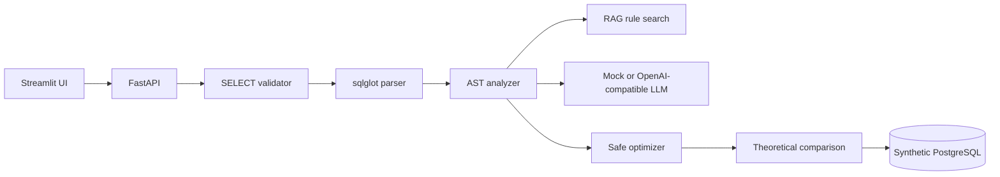
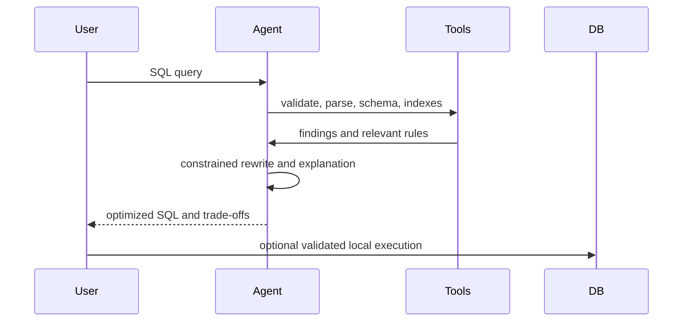

# AI SQL Query Optimizer

**Status: Completed portfolio implementation; synthetic data and mock integrations**

**Status: Completed portfolio implementation; synthetic data and mock integrations**

Portfolio project demonstrating a safety-first SQL optimization assistant over a synthetic PostgreSQL database. It detects common performance risks, retrieves tuning guidance, proposes constrained rewrites, and clearly labels unmeasured benefits as theoretical.

## Business Problem

SQL problems are often discovered after latency, cost, or concurrency has degraded. This service gives engineers a repeatable first review of projections, predicates, joins, sorting, grouping, and indexes without requiring production credentials or production queries.

## Architecture



## Workflow



The agent uses `validate_sql`, `parse_sql`, `analyze_query`, `get_schema`, `get_indexes`, `search_optimization_rules`, `generate_optimized_sql`, and `compare_queries`. Mock mode is deterministic and never invents execution percentages.

## Quick Start

```powershell
python -m venv .venv
.\\.venv\\Scripts\\Activate.ps1
pip install -r requirements.txt
uvicorn app.main:app --reload
```

Open `http://localhost:8000/docs` for the API or run `streamlit run streamlit_app/app.py` in another terminal.

## Docker

```powershell
docker compose up --build
```

API: `http://localhost:8000`, UI: `http://localhost:8501`, PostgreSQL: `localhost:5432`.

## Example

Input:

```sql
SELECT * FROM orders o
JOIN customers c ON o.customer_id = c.customer_id
WHERE YEAR(o.order_date) = 2026
ORDER BY o.order_date DESC;
```

The optimizer identifies `SELECT *`, a function on a date column, and a possible sort. It rewrites the date condition to the half-open range `order_date >= '2026-01-01' AND order_date < '2027-01-01'`. This can preserve index range access, but the result must be measured with representative data.

## API

`POST /api/v1/analyze`, `/optimize`, `/validate`, `/compare`; `GET /api/v1/schema`; `GET /health`.

## RAG and AI

`app/rules/knowledge.py` is a transparent retrieval corpus covering sargability, projections, joins, sorting, cardinality, indexes, and safe execution. `LLM_MODE=mock` is the default. Set `LLM_MODE` and `OPENAI_API_KEY` only when an OpenAI-compatible endpoint is intentionally configured; deterministic rules remain the source of truth.

## Security

The validator blocks write/DDL/admin keywords and parses SQL before execution. Optional execution wraps a validated query in a row-limited outer SELECT and uses a configured local database. Do not point this demo at production. Observability records a short query fingerprint, event, latency, and error flag, never raw SQL.

## Evaluation

`evaluation/examples.json` contains 40 synthetic examples spanning joins, aggregations, subqueries, CTEs, windows, indexes, date predicates, sorting, and filtering. Run `python -m evaluation.runner`. Accuracy is a labeled rule-detection metric; semantic equivalence and hallucination rate require a larger reviewed corpus and measured query pairs.

## Testing

```powershell
pytest -q
```

Tests cover parsing, analysis, safe rewriting, dangerous SQL detection, RAG, and API behavior. Limitations include heuristic index recommendations, no cost-based plan model, and no fabricated runtime comparison when execution statistics are unavailable.

## Screenshots

Run the Streamlit app locally and capture the analysis view for a repository screenshot. The UI is intentionally generated from the live API rather than storing client or production artifacts.

## Future Improvements

Add PostgreSQL `EXPLAIN (FORMAT JSON)` ingestion, schema-aware type conversion checks, workload-level index analysis, a reviewed benchmark corpus, asynchronous execution cancellation, and an audited provider adapter for additional OpenAI-compatible models.

## Portfolio Talking Points

- Built a FastAPI and Streamlit SQL tuning assistant with sqlglot AST analysis and PostgreSQL synthetic data.
- Implemented safety controls for SELECT-only validation, row limits, local execution, and privacy-preserving observability.
- Designed transparent RAG and tool-calling orchestration so the LLM explains verified findings instead of inventing metrics.

### Interview Questions

1. Why is a half-open date range safer than `BETWEEN` for timestamps?
2. When is an index harmful despite improving a read query?
3. How would you prove semantic equivalence between two SQL statements?
4. How do cardinality estimates affect join and index choices?
5. How would you safely expose `EXPLAIN ANALYZE`?

### AI System Design Questions

1. How would you ground an optimizer's recommendations in schema and plan evidence?
2. How would you detect and measure LLM hallucinations in generated SQL?
3. How would you isolate tenant data and secrets in a hosted version?
4. What tool-call policy prevents the model from bypassing validation?
5. How would you build a feedback loop from accepted recommendations?

## Resume Relevance

Demonstrates Python, FastAPI, Streamlit, SQLGlot AST parsing, read-only SQL policy, PostgreSQL, RAG-style rules, Docker, testing, and evaluation without claiming unmeasured performance gains.

## Author and Related Work

**Sunil Javadi** · [GitHub](https://github.com/suniljavadi) · [Portfolio](https://github.com/suniljavadi/sunil-portfolio) · [LinkedIn](https://www.linkedin.com/in/sunil-javadi/)

- [AI SQL Optimizer](https://github.com/suniljavadi/AI-SQL-Optimizer)
- [Enterprise Text-to-SQL AI Agent](https://github.com/suniljavadi/Text-to-SQL-AI-Agent)
- [Data Engineering MCP Server](https://github.com/suniljavadi/data-engineering-mcp-server)

## Local Git Workflow

```powershell
git add .
git commit -m "Build AI SQL query optimizer"
git push origin main
```
